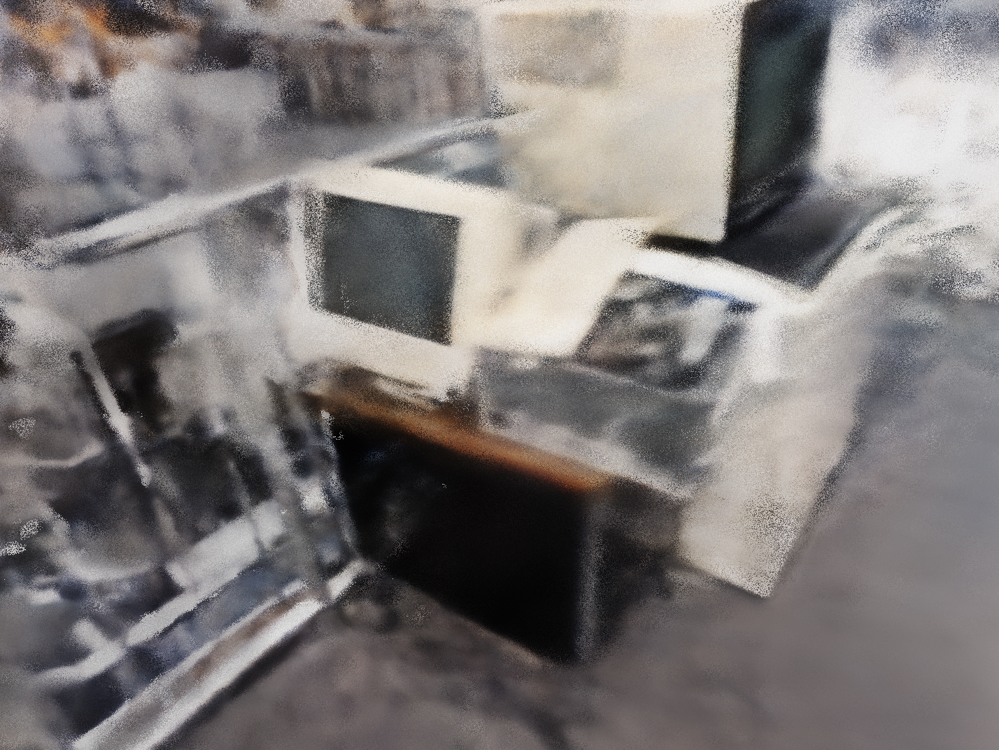
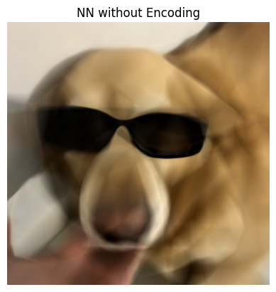

## About Me
<tr>
    <td> </td>
	<!-- <td>
		<iframe src="https://antimatter15.com/splat/?url=https://aman190202.github.io/model-5.splat" width="300" height="300" style="border:none;  float: right;"></iframe>
	</td> -->
    <td>

		Sc.M. @ Brown University  
        Visual Computing & AI 
		  
		<a href="mailto:amanag@brown.edu">
			<i class="fa fa-envelope" aria-hidden="true"></i> amanag@brown.edu</a>   
		<a href="https://github.com/aman190202">
			<i class="fa fa-github" aria-hidden="true"></i> Github </a>   
		<!-- <a href="https://scholar.google.com/citations?user=9ixpc8MAAAAJ&hl=en&oi=ao">
			<i class="fa fa-google" aria-hidden="true"></i> Google Scholar </a>    -->
		<a href="https://www.linkedin.com/in/aman190202/">
			<i class="fa fa-linkedin" aria-hidden="true"></i> LinkedIn </a>   
		<a href="https://antimatter15.com/splat/?url=https://aman190202.github.io/model-5.splat">
			<i aria-hidden="true"></i> 💻 Watch me in 3D</a>
             
			 
	
</td>
</tr>

I'm a Master's student in Computer Science at Brown University, specializing in **Visual Computing and AI**. I am advised by [Dr. James Tompkin](https://jamestompkin.com), and my current research focuses on interpretibility of 3D and 4D feedforward models.

---
## Experience



### {{ year.name }}	
---


<table class="paper-list">
  <tr>
  	
    <td></td>
	
	
    <td>
		

		<video width="80%" height="80%" muted autoplay loop>
			<source src="{{paper.paper-logo-mp4}}" type="video/mp4">
			Your browser does not support the video tag.
		</video>
		

	</td>
	
    <td>
		
{{jobs.title}}
  
		

			{{jobs.description}}
		

		
{{paper.paper-pub}}

		

			
			<a href="{{paper.link-pdf}}" target="_blank" rel="noopener">
				<i class="fa fa-file-pdf-o" aria-hidden="true"></i> PDF </a>
			

		

	</td>
  </tr>
</table>



<!-- ## Publications



### {{ year.name }}	
---


<table class="paper-list">
  <tr>
  	
    <td></td>
	
	
    <td>
		

		<video width="80%" height="80%" muted autoplay loop>
			<source src="{{paper.paper-logo-mp4}}" type="video/mp4">
			Your browser does not support the video tag.
		</video>
		

	</td>
	
    <td>
		
{{paper.paper-title}}
  
		

			
				
					{{author.name}}.
				
					{{author.name}},
				
			
		

		
{{paper.paper-pub}}

		

			
			<a href="{{paper.link-pdf}}" target="_blank" rel="noopener">
				<i class="fa fa-file-pdf-o" aria-hidden="true"></i> PDF </a>
			

		

	</td>
  </tr>
</table>

 -->

---
<!-- ## Projects

<tr>
    <td>

	    <a href="https://github.com/aman190202/neural_fields_bvc">
            <i class="fa fa-github" aria-hidden="true"></i> Neural Fields with encoding:</a> A comparision of different encoding methods for 2D inputs
              
              
        <a href="https://github.com/aman190202/LovingVincentt">
			<i class="fa fa-github" aria-hidden="true"></i> Loving Vincet:</a> Convert your videos into moving paintings of your choice
              
              
        <a href="https://github.com/aman190202/ray_tracing_weekend">
			<i class="fa fa-github" aria-hidden="true"></i>  Ray Tracer on MLX:</a> Implementing an entire Ray Tracer built from scratch in NumPy and modifying it to run on <a href="https://ml-explore.github.io/mlx/build/html/index.html">MLX</a>,a NumPy-like array framework designed for efficient and flexible machine learning on Apple silicon. [Ongoing]
             
			  
        <a href="https://devpost.com/software/rescue-shark">
			<i class="fa fa-github" aria-hidden="true"></i>  Rescue Shark:</a> Built a SOS application for Truck Drivers - Won a MLH Hackathon for "Most Creative Use of Twilio"
             
			  
	
</td>
</tr> -->

## Projects

    <!-- Project 0 -->
    

        

            <a href="https://github.com/aman190202/cuda" style="text-decoration: none; color: inherit;">
                <video controls style="width: 100%; border-radius: 10px; max-height: 200px;">
                    <source src="assets/100000.mov" type="video/mp4">Your browser does not support the video tag.
                </video>
                <h3>Explosion</h3>
            </a>
        

        

            Designed and implemented a volumetric path tracer to render explosions with millions of lights
        

    

    <!-- Project 1 -->
    

        

            <a href="https://github.com/aman190202/Clouds" style="text-decoration: none; color: inherit;">
                <video controls style="width: 100%; border-radius: 10px; max-height: 200px;">
                    <source src="assets/FullHD.mp4" type="video/mp4">Your browser does not support the video tag.
                </video>
                <h3>Volummetric Rendering for Clouds & Procuderal Terrain, on OpenMP</h3>
            </a>
        

        

            Designed and implemented a custom ray-marcher and ray-tracer from scratch to render realistic clouds and generate procedural terrain. The rendered scene includes dynamic interactions with point lights, creating visually accurate and immersive effects.
        

    

    
    <!-- Project 2 -->
    

        

            <a href="https://github.com/aman190202/small_NeRF" style="text-decoration: none; color: inherit;">
                
                <h3>Implemented NeRFs</h3>
            </a>
        

        
Implemented the <a href="https://arxiv.org/abs/2003.08934">Neural Radiance Fields</a> paper by Ben Mildenhall et al.; Removed heirarical sampling to reduce complexity while maintaining PSNR scores.

    

    
    <!-- Project 3 -->
    

        

            <a href="https://github.com/aman190202/neural_fields_bvc" style="text-decoration: none; color: inherit;">
                
                <h3>Neural Fields with Encoding</h3>
            </a>
        

        
A comparison of different encoding methods for 2D inputs

    

    
    <!-- Project 4 -->
    

        

            <a href="https://github.com/aman190202/LovingVincentt" style="text-decoration: none; color: inherit;">
                
                <h3>Loving Vincent</h3>
            </a>
        

        
Convert your videos into moving paintings of your choice

    

    
    <!-- Project 5 -->
    

        

            <a href="https://devpost.com/software/rescue-shark" style="text-decoration: none; color: inherit;">
                
                <h3>Rescue Shark</h3>
            </a>
        

        
Built an SOS application for Truck Drivers - Won a MLH Hackathon for "Most Creative Use of Twilio"

    

<!-- ---
## Invited talks

Date | Event | Details
-----|-------|--------
April, 24th 2024 | FMX 2024  | Survey on NeRFs and 3DGS for the Lighting & Rendering track organized by [Christophe Hery](https://www.linkedin.com/in/christophehery/) in Stuttgart, Germany. Thank you all for the great time there!
May, 6th 2024 | Machine Learning Coffee Seminar | Finnish Center for Artificial Intelligence (FCAI) [talk](https://fcai.fi/calendar/2024/5/6/juho-kannala-tba) on neural rendering. -->

---
 
 Template Credits : <a href="https://maturk.github.io">Matias Turkulainen</a>

