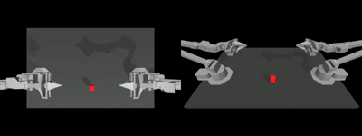
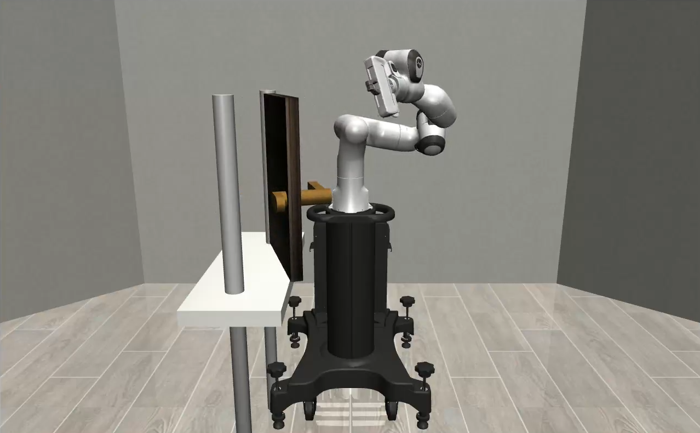

## About Me
<table style="border: none; background: transparent; width: 100%;">
  <tr>
    <td style="width: 70%; vertical-align: middle; border: none; padding-right: 20px;">
      

		M.Sc @ University of Minnesota  
        Robotics 
		  
		<a href="mailto:narkh009@umn.edu">
			<i class="fa fa-envelope" aria-hidden="true"></i> narkh009@umn.edu</a>  
		<a href="https://github.com/ronsys11">
			<i class="fa fa-github" aria-hidden="true"></i> Github </a>  
		<a href="https://www.linkedin.com/in/ronak-narkhede/">
			<i class="fa fa-linkedin" aria-hidden="true"></i> LinkedIn </a>  
			 
			 
	  

      

        Hello! I am Ronak, a graduate student at the <b>Medical Robotics and Devices Lab</b> working with <a href="https://cse.umn.edu/me/tim-kowalewski">Professor Timothy Kowaleski</a>. My current research focuses on <b>making stroke thrombectomy accessible</b> through telerobotic surgical systems. I am drawn to hardware because tools are how humans built civilizations, and I believe robots are the next iteration. They'll help us build at scale and eventually climb the Kardashev scale. I want to be part of that story (and also generate shareholder value along the way:)).
          
        Try out the <a href="https://alpha.stroke-robot.org/">live telerobotic demo here</a>.
          
        When I am not working on my robotic arms, you'll find me watching sports, cooking exotic cuisines, and hosting friends who are brave enough to try them.
      

    </td>
    <td style="width: 30%; vertical-align: middle; border: none; text-align: center;">
      
    </td>
  </tr>
</table>

---
## Experience



### {{ year.name }}	
---


<table class="paper-list" style="margin-top: 15px;">
  <tr>
  	
    <td style="width: 200px; min-width: 200px; text-align: center; vertical-align: middle;">
        
    </td>
	
	
    <td>
		

		<video width="80%" height="80%" muted autoplay loop>
			<source src="{{paper.paper-logo-mp4}}" type="video/mp4">
			Your browser does not support the video tag.
		</video>
		

	</td>
	
    <td>
		
{{jobs.title}}
  
		

			{{jobs.description}}
		

		
{{paper.paper-pub}}

		

			
			<a href="{{paper.link-pdf}}" target="_blank" rel="noopener">
				<i class="fa fa-file-pdf-o" aria-hidden="true"></i> PDF </a>
			

		

	</td>
  </tr>
</table>



## Publications



### {{ year.name }}	
---


<table class="paper-list">
  <tr>
  	
    <td></td>
	
	
    <td>
		

		<video width="80%" height="80%" muted autoplay loop>
			<source src="{{paper.paper-logo-mp4}}" type="video/mp4">
			Your browser does not support the video tag.
		</video>
		

	</td>
	
    <td>
		
{{paper.paper-title}}
  
		

			
				
					{{author.name}}.
				
					{{author.name}},
				
			
		

		
{{paper.paper-pub}}

		

			
			<a href="{{paper.link-pdf}}" target="_blank" rel="noopener">
				<i class="fa fa-file-pdf-o" aria-hidden="true"></i> PDF </a>
			

		

	</td>
  </tr>
</table>



---
<!-- ## Projects

<tr>
    <td>

	    <a href="https://github.com/aman190202/neural_fields_bvc">
            <i class="fa fa-github" aria-hidden="true"></i> Neural Fields with encoding:</a> A comparision of different encoding methods for 2D inputs
              
              
        <a href="https://github.com/aman190202/LovingVincentt">
			<i class="fa fa-github" aria-hidden="true"></i> Loving Vincet:</a> Convert your videos into moving paintings of your choice
              
              
        <a href="https://github.com/aman190202/ray_tracing_weekend">
			<i class="fa fa-github" aria-hidden="true"></i>  Ray Tracer on MLX:</a> Implementing an entire Ray Tracer built from scratch in NumPy and modifying it to run on <a href="https://ml-explore.github.io/mlx/build/html/index.html">MLX</a>,a NumPy-like array framework designed for efficient and flexible machine learning on Apple silicon. [Ongoing]
             
			  
        <a href="https://devpost.com/software/rescue-shark">
			<i class="fa fa-github" aria-hidden="true"></i>  Rescue Shark:</a> Built a SOS application for Truck Drivers - Won a MLH Hackathon for "Most Creative Use of Twilio"
             
			  
	
</td>
</tr> -->

## Projects

    <!-- Project 1: UR5 Flashlight Assembly -->
    

        

            <a href="https://drive.google.com/drive/u/0/folders/1ctY7z71yzgrHjeew_uOCG2yhOH7aU4XC" style="text-decoration: none; color: inherit;">
                
                <h3>UR5 Flashlight Assembly</h3>
            </a>
        

        
Using RoboDK and Python API to write a flashlight assembly program.

    

    <!-- Project 2: Teleoperated Robot Arm -->
    

        

            <a href="https://drive.google.com/file/d/11_A4dyopk6ykT5S--rciaXSho9IaOo9-/view?usp=drive_link" style="text-decoration: none; color: inherit;">
                
                <h3>(Ongoing) Teleoperated 6 DOF Robot Arm</h3>
            </a>
        

        
The problems you face when simulating robots versus working with actual hardware are very different, which is why I decided to build my own robot arm setup at home. I plan to learn Rust by writing its control system in it.

    

    
    <!-- Project 3: Transformer Policy for Aloha Robot -->
    

        

            <a href="https://drive.google.com/drive/u/0/folders/15IMl670nH-7Ln1oAfM3LpgCL-k2uVWAq" style="text-decoration: none; color: inherit;">
                
                <h3>Transformer Policy for Aloha Robot</h3>
            </a>
        

        
A transformer based policy using PyTorch for bi-manual robotic manipulation tasks, enabling robots to perform complex actions such as cube transfer and insertion in simulated and real-world environments.

    

    
    <!-- Project 4: Sir Hovers-a-Lot (Drone) -->
    

        

            <a href="https://drive.google.com/drive/folders/1iw5D4wbwfcecyPsg6_81mdaVSpeTGBU_" style="text-decoration: none; color: inherit;">
                
                <h3>Sir Hovers-a-Lot (Drone)</h3>
            </a>
        

        
Developed a quadcopter drone equipped with autonomy and mapping capabilities. Integrated SLAM using Hector SLAM for 2D mapping and ORB-SLAM3 for 3D visual-inertial navigation. Implemented behavioral cloning.

    

    
    <!-- Project 5: Vision based Robot Control -->
    

        

            <a href="https://drive.google.com/drive/folders/1F3ncokIQqA96nlAp_7txGGaQY-cq6g5M" style="text-decoration: none; color: inherit;">
                
                <h3>Vision based Robot Control</h3>
            </a>
        

        
Developed a novel Human-Machine Interface to simplify programming robotic manipulators. Utilized a wireless pointer and a stereo camera for intuitive point selection and task simulation. Integrated ROS, ArUco markers, and visual feedback.

    

    
    <!-- Project 6: 6 DOF EM Motion Tracker -->
    

        

            <a href="https://drive.google.com/file/d/1KZv5142z8e9m32j-nkVnDMWSq6dzEXOI/view?usp=drive_link" style="text-decoration: none; color: inherit;">
                
                <h3>(Ongoing) 6 DOF EM Motion Tracker</h3>
            </a>
        

        
Built real time motion tracking system using EM sensor for 6 DOF pose estimation in surgical navigation application. Developed sensor data processing pipeline with Kalman filtering for position tracking at 120 Hz update rate.

    

    
    <!-- Project 7: ArUco Cube Pose Estimation -->
    

        

            <a href="https://drive.google.com/drive/folders/1jvETnl3htr7RRM5neljxJIG9WsdGSKbh" style="text-decoration: none; color: inherit;">
                
                <h3>ArUco Cube Pose Estimation</h3>
            </a>
        

        
Real-time ArUco marker detection using OpenCV. Pose estimation for a cube with ArUco markers. Visualizing the detected cube in RViz with the help of RViz markers.

    

    
    <!-- Project 8: TD3 Door Opening Agent -->
    

        

            <a href="https://drive.google.com/drive/folders/1wWLABdD6L2ZanNf9owkOiDKWn6KCdfWc" style="text-decoration: none; color: inherit;">
                
                <h3>TD3 Based Door Opening Agent</h3>
            </a>
        

        
A PyTorch implementation of TD3 applied to opening a door controlling a Panda robot in Robosuite environments.

    

---
## Invited talks

Date | Event | Details
-----|-------|--------
April 30, 2025 | Design of Medical Devices Conference | Talk revieiwng the Corpath GRX and Magellan robot for stroke intervention. [Link](https://dmd.umn.edu/2025/robotics)

---
 
 Template Credits : <a href="https://maturk.github.io">Matias Turkulainen</a>
