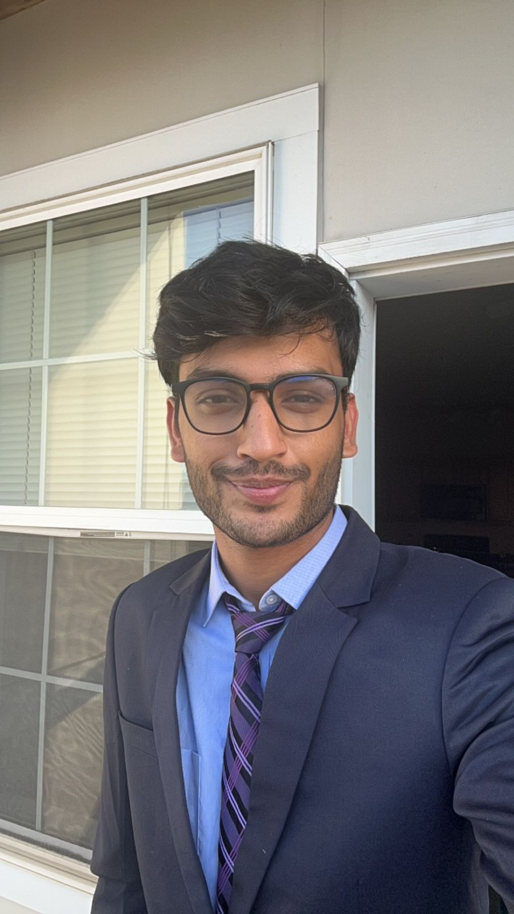
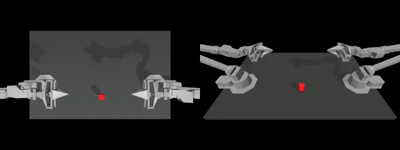
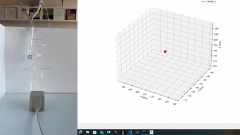
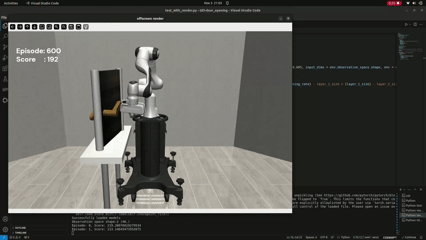

## About Me
<table style="border: none; background: transparent; width: 100%;">
  <tr>
    <td style="width: 70%; vertical-align: middle; border: none; padding-right: 20px;">
      

		M.Sc @ University of Minnesota  
        Robotics 
		  
		<a href="mailto:narkh009@umn.edu">
			<i class="fa fa-envelope" aria-hidden="true"></i> narkh009@umn.edu</a>  
		<a href="https://github.com/ronsys11">
			<i class="fa fa-github" aria-hidden="true"></i> Github </a>  
		<a href="https://www.linkedin.com/in/ronak-narkhede/">
			<i class="fa fa-linkedin" aria-hidden="true"></i> LinkedIn </a>  
			 
	  

      

        Hello! I am Ronak, a graduate student at the <b>Medical Robotics and Devices Lab</b> working with <a href="https://cse.umn.edu/me/tim-kowalewski">Professor Timothy Kowaleski</a>. My current research focuses on <b>making stroke thrombectomy accessible</b> through telerobotic surgical systems. I am drawn to hardware because tools are how humans built civilizations, and I believe robots are the next iteration. They'll help us build at scale and eventually climb the Kardashev scale. I want to be part of that story (and also generate shareholder value along the way:)).
          
        Try out the <a href="https://alpha.stroke-robot.org/">live telerobotic demo here</a>.
          
      

    </td>
    <td style="width: 30%; vertical-align: middle; border: none; text-align: center;">
      
    </td>
  </tr>
</table>

---
## Experience



### {{ year.name }}	
---


<table class="paper-list" style="margin-top: 15px;">
  <tr>
  	
    <td style="width: 200px; min-width: 200px; text-align: center; vertical-align: middle;">
        
    </td>
	
	
    <td>
		

		<video width="80%" height="80%" muted autoplay loop>
			<source src="{{paper.paper-logo-mp4}}" type="video/mp4">
			Your browser does not support the video tag.
		</video>
		

	</td>
	
    <td>
		
{{jobs.title}}
  
		

			{{jobs.description}}
		

		
{{paper.paper-pub}}

		

			
			<a href="{{paper.link-pdf}}" target="_blank" rel="noopener">
				<i class="fa fa-file-pdf-o" aria-hidden="true"></i> PDF </a>
			

		

	</td>
  </tr>
</table>



## Publications



### {{ year.name }}	
---


<table class="paper-list">
  <tr>
  	
    <td></td>
	
	
    <td>
		

		<video width="80%" height="80%" muted autoplay loop>
			<source src="{{paper.paper-logo-mp4}}" type="video/mp4">
			Your browser does not support the video tag.
		</video>
		

	</td>
	
    <td>
		
{{paper.paper-title}}
  
		

			
				
					{{author.name}}.
				
					{{author.name}},
				
			
		

		
{{paper.paper-pub}}

		

			
			<a href="{{paper.link-pdf}}" target="_blank" rel="noopener">
				<i class="fa fa-file-pdf-o" aria-hidden="true"></i> PDF </a>
			

		

	</td>
  </tr>
</table>



---
<!-- ## Projects

<tr>
    <td>

	    <a href="https://github.com/aman190202/neural_fields_bvc">
            <i class="fa fa-github" aria-hidden="true"></i> Neural Fields with encoding:</a> A comparision of different encoding methods for 2D inputs
              
              
        <a href="https://github.com/aman190202/LovingVincentt">
			<i class="fa fa-github" aria-hidden="true"></i> Loving Vincet:</a> Convert your videos into moving paintings of your choice
              
              
        <a href="https://github.com/aman190202/ray_tracing_weekend">
			<i class="fa fa-github" aria-hidden="true"></i>  Ray Tracer on MLX:</a> Implementing an entire Ray Tracer built from scratch in NumPy and modifying it to run on <a href="https://ml-explore.github.io/mlx/build/html/index.html">MLX</a>,a NumPy-like array framework designed for efficient and flexible machine learning on Apple silicon. [Ongoing]
             
			  
        <a href="https://devpost.com/software/rescue-shark">
			<i class="fa fa-github" aria-hidden="true"></i>  Rescue Shark:</a> Built a SOS application for Truck Drivers - Won a MLH Hackathon for "Most Creative Use of Twilio"
             
			  
	
</td>
</tr> -->

## Projects

    <!-- Project 1: Surgeon-Side VR Teleoperating Console -->
    

        

            <a href="https://alpha.stroke-robot.org/" style="text-decoration: none; color: inherit;">
                
                <h3>Surgeon-Side VR Teleoperating Console</h3>
            </a>
        

        
Meta Quest 3 AR app built in Unity 6 with Meta XR SDK. Loads a vascular mesh from patient data. Navigation mode renders a centerline graph as a cyan skeleton on a semi-transparent vessel mesh, with BFS pathfinding to the clot. Streams live MJPEG video and teleoperates a 2-DOF surgical robot through a vascular phantom.

    

    <!-- Project 2: Autonomous Catheter Navigation -->
    

        

            <a href="assets/projects/proj_auto_catheter.gif" style="text-decoration: none; color: inherit;">
                
                <h3>Autonomous Catheter Navigation</h3>
            </a>
        

        
Built an autonomous catheter navigation system using a 1-DOF steerable catheter with an EM tracker embedded at the tip. It uses an online Jacobian based controller that maps tip displacement error to actuation commands to achieve accurate, closed loop navigation in a minimally invasive setting.

    

    <!-- Project 3: UR5 Flashlight Assembly -->
    

        

            <a href="https://drive.google.com/drive/u/0/folders/1ctY7z71yzgrHjeew_uOCG2yhOH7aU4XC" style="text-decoration: none; color: inherit;">
                
                <h3>UR5 Flashlight Assembly</h3>
            </a>
        

        
Programmed a UR5 for automated flashlight assembly using Python (RoboDK) and URScript, with pneumatic grippers and force-controlled threading. Implemented Cartesian impedance control from raw force sensor feedback for compliant peg-in-hole insertion without vision. Tuned TCP offsets and center of gravity for reliable force-controlled operations.

    

    <!-- Project 4: Teleoperated Robot Arm -->
    

        

            <a href="https://drive.google.com/file/d/11_A4dyopk6ykT5S--rciaXSho9IaOo9-/view?usp=drive_link" style="text-decoration: none; color: inherit;">
                
                <h3>(Ongoing) Teleoperated 6 DOF Robot Arm</h3>
            </a>
        

        
The problems you face when simulating robots versus working with actual hardware are very different, which is why I decided to build my own robot arm setup at home. I plan to learn Rust by writing its control system in it.

    

    
    <!-- Project 5: Transformer Policy for Aloha Robot -->
    

        

            <a href="https://drive.google.com/drive/u/0/folders/15IMl670nH-7Ln1oAfM3LpgCL-k2uVWAq" style="text-decoration: none; color: inherit;">
                
                <h3>Transformer Policy for Aloha Robot</h3>
            </a>
        

        
A transformer based policy using PyTorch for bi-manual robotic manipulation tasks, enabling robots to perform complex actions such as cube transfer and insertion in simulated and real-world environments.

    

    
    <!-- Project 6: Vision based Robot Control -->
    

        

            <a href="https://drive.google.com/drive/folders/1F3ncokIQqA96nlAp_7txGGaQY-cq6g5M" style="text-decoration: none; color: inherit;">
                
                <h3>Vision based Robot Control</h3>
            </a>
        

        
Built a wireless vision-based teach pendant for a 3-DOF robot arm using a stereo camera and ArUco markers for hand-eye calibration and intuitive 3D point selection. Engineered a ROS control pipeline to transform selected 3D coordinates into target joint angles via numerical inverse kinematics.

    

    
    <!-- Project 7: 6 DOF EM Motion Tracker -->
    

        

            <a href="https://drive.google.com/file/d/1KZv5142z8e9m32j-nkVnDMWSq6dzEXOI/view?usp=drive_link" style="text-decoration: none; color: inherit;">
                
                <h3>6 DOF EM Motion Tracker</h3>
            </a>
        

        
Built real time motion tracking system using EM sensor for 6 DOF pose estimation in surgical navigation application. Developed sensor data processing pipeline with Kalman filtering for position tracking at 120 Hz update rate.

    

    
    <!-- Project 8: ArUco Cube Pose Estimation -->
    

        

            <a href="https://drive.google.com/drive/folders/1jvETnl3htr7RRM5neljxJIG9WsdGSKbh" style="text-decoration: none; color: inherit;">
                
                <h3>ArUco Cube Pose Estimation</h3>
            </a>
        

        
Real-time ArUco marker detection using OpenCV. Pose estimation for a cube with ArUco markers. Visualizing the detected cube in RViz with the help of RViz markers.

    

    
    <!-- Project 9: TD3 Door Opening Agent -->
    

        

            <a href="https://drive.google.com/drive/folders/1wWLABdD6L2ZanNf9owkOiDKWn6KCdfWc" style="text-decoration: none; color: inherit;">
                
                <h3>TD3 Based Door Opening Agent</h3>
            </a>
        

        
A PyTorch implementation of TD3 applied to opening a door controlling a Panda robot in Robosuite environments.

    

---
## Invited talks

Date | Event | Details
-----|-------|--------
April 30, 2025 | Design of Medical Devices Conference | Talk reviewing the Corpath GRX and Magellan robot for stroke intervention. [Link](https://dmd.umn.edu/2025/robotics)

---
---
 

    <blockquote>
        I have long believed that the greatest asset anyone can possess is a problem worth solving.
    </blockquote>

---
 
 Template Credits : <a href="https://maturk.github.io">Matias Turkulainen</a>
